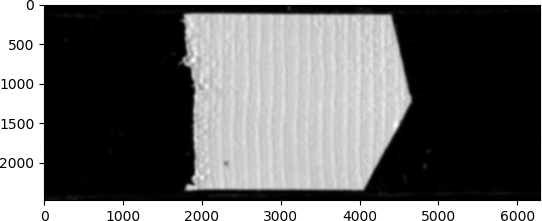
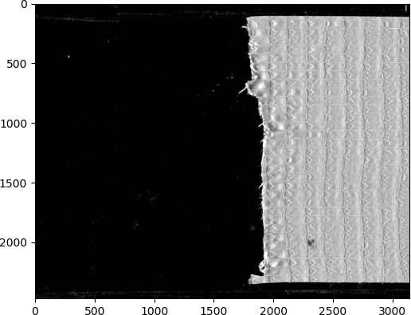
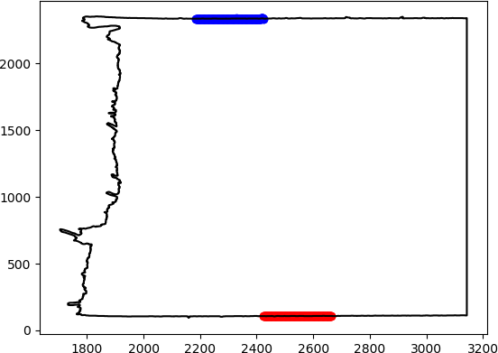
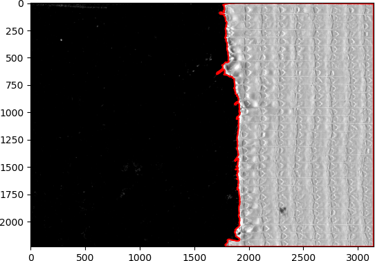

Tutorials
=========

The following set of tutorials explains the basic usage of this package. 
The examples provide information on how to use the preprocessing method for different
approaches. Later it will explain how one can use the data generated in this 
section in different Machine Learning approaches using keras package.

Preprocessing
-------------

At first we will explain the steps one has to take to process a single image, 
Then we will move to processing directories of images. Each gray scale image is constructed from a grid of pixels. Each pixel contains a number from 0 to 255 representing the gray shade of that specific pixel.

1. Single image processing
~~~~~~~~~~~~~~~~~~~~~~~~~~

All of our tutorials are eplained in ipython interactive session, However these
commands can be easily moved to a python script for more automation.

1.1. Loading the image and show
^^^^^^^^^^^^^^^^^^^^^^^^^^^^^^^
Given the path to the image forensicfit will create a TapeImage object.

Usage::

  import forensicfit
  tape_image = forensicfit.TapeImage(fname='L001.tiff')

``tape_image`` is a TapeImage object with different properties and method in 
this section we will explain the usage of each method and property.
Before explaining each of the methods, let's list the input parameter of this 
class. A comprehensive description of each parameter is provided in the 
`API package <forensicfit.preprocess.html#module-forensicfit.preprocess.tape_image>`_ section.
To show the image we can use the method ``show``.

Usage::

    tape_image = forensicfir.TapeImage(fname='LQ_775.tiff')
    tape_image.show(cmap='gray')
    
The following plot will appear as a confirmation that the image has been loaded.
As ``cmap`` defines the color map for the gray scale image. 

``gaussian_blur`` is also an important filter that is applied in the begining of this class.
This filter is applied to image to decrease the image noise and help the finding of the 
boundaries. A good number usually depends on the amount of the noise the scanner 
adds to the image. This parameter defines the window of pixels in which this filter is applied.
The default of this paramter is ``gaussian_blur=(15,15)``. To demonstrate the effects of this 
filter we choose a large window to exagerate the effect. The window has to be alway constructed 
by odd numbers.

Usage::

    tape_image = forensicfit.preprocess.TapeImage('LQ_775.tif',
                                gaussian_blur=(101,101))

1.2. Splitting the image vertically
^^^^^^^^^^^^^^^^^^^^^^^^^^^^^^^^^^^
Sometimes one does not need one side of the image. To address this issue ``split``
parameter is implemented.One has to turn on the split paramter by ``split=True``,
Then select the side of the image that is important to us (``'L'`` for left or ``'R'`` for right) 
by ``split_side='L'`` (important: do not forget that this parameter has to a python string), and 
finally one has to choose the ``split_position``. split_position can only be a number between 0 
and 1. for example if ``split_position=0.5``, the image will be divided in the half way line. The defaults are 
``split=False``, ``split_position=0.5`` and ``split_side='L'``.
Let's also view the split image by using the ``show()`` method.

Usage::
    
    tape_image = forensicfir.TapeImage(fname='LQ_775.tiff',
                                        split=True,
                                        split_side='L',
                                        split_position=0.5)
    tape_image.show(cmap='gray')

1.3. Finding the tilt of the image
^^^^^^^^^^^^^^^^^^^^^^^^^^^^^^^^^^
During the scanning process one might not position the image exactly parallel to the 
horizontal line. The property of ``image_tilt`` can calculate the tilt of the tape. To calculate 
this number the algorithm finds the boundaries at the top and the bottom of the image.
Then each line is divided in 6 segments(our experience showed that 6 is segments usually works good). 
The first and the last segments are discarted to avoid noise close to the edge. The the slop and standard 
deviation(in y direction) is calculated with a linear fit. The two
segments with the least are selected from the top and bottom. Furthur more the average angle 
by each line is reported in degrees.

Usage::

    print(tape_image.image_tilt)
    0.12844069008595374

If one wants to monitor all of the steps of the selection of the best segment for angle calculation,
One can use the ``get_image_tilt(plot=True)``, with the plot parameter turn on(True).

Usage::

    tape_image.get_image_tilt(plot=True)

This method will produce two plots one with all of the segments shown in diferent colors,

and one with the two segments with the least standard deviation, plotted over the detected boundary.

1.4. Plot Boundaries
^^^^^^^^^^^^^^^^^^^^
This class automatically(using opencv) detects the boundaries. To plot this boundary 
one has to use, ``plot_boundary(color='red')``. As it's self explanatory the color 
parameter changes the color of the boundary. To plot this boundary one has to plot 
the image first then use the plot boundary similar to the following example.

Usage::

    tape_image.show(cmap='gray')
    tape_image.plot_boundary(color='red')

1.5. Auto Crop in Y direction
^^^^^^^^^^^^^^^^^^^^^^^^^^^^^
``auto_crop_y()`` will automatically crop the image based on the boundaries that it found.
To make this example more interesting we add a plot boundary function as well.
 
Usage::

    tape_image.auto_crop_y()
    tape_image.show(cmap='gray')
    tape_image.plot_boundary(color='red')
    

    

.. toctree::
   
   preprocess
   preprocess_dir
   machine_learning
   
